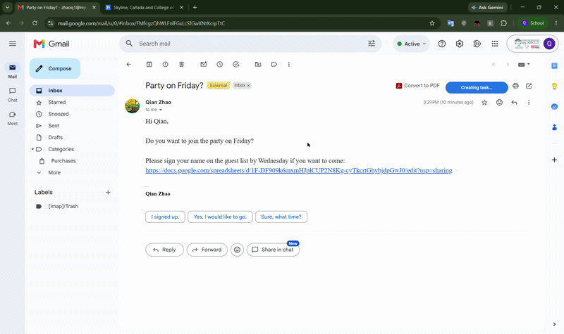

# Email To Task with Gemini Nano

Use Chrome's built-in Prompt API (Gemini Nano) in an extension to extract and creat task on Google Calendar from Gmail, see [Prompt API on developer.chrome.com](https://developer.chrome.com/docs/extensions/ai/prompt-api).

## Overview

Email To Task extension for allows users to quickly create task from a specific gmail by click on "Create Task on Calendar" buttom. The extension uses Gemini Nano to extract:

- Task title
- Task due date
- Original Email link for reference
- Important action links (e.g., Google Form link)
- AI summary

The extracted details are used to creat a new task on Google Calendar.

## User permissions

- "https://mail.google.com/*" - access to Gmail pages

## Running this extension locally

1. Clone and download this repository.
2. Go to the Extensions page by entering `chrome://extensions` in a new tab. 
3. Enable Developer Mode by clicking the toggle switch next to Developer mode.
4. Load the `dist` directory in Chrome as an [unpacked extension](https://developer.chrome.com/docs/extensions/get-started/tutorial/hello-world#load-unpacked).
5. Open a specific gmail that describes a task.
6. Click on "Create Task on Calendar."

## How it works

- Gemini Nano: Extract Data & Prompt Local AI
- `chrome.identity.getAuthToken()`:authenticates the user with Google
- [Execute Google Tasks API Write](https://developers.google.com/workspace/tasks/reference/rest)

## Future Work

1. If AI unavailable or fails → Fallback parser runs
2. Fallback extracts dates, titles, summaries using regex patterns
3. Returns valid task data in same format as AI

## Acknowledgement

This project follows Gemini Nano tutorial by GoogleChrome:
https://github.com/GoogleChrome/chrome-extensions-samples/tree/main/functional-samples/ai.gemini-on-device-calendar-mate